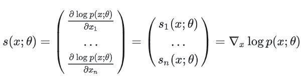

## 得分匹配
假设我们有一系列的样本点$`x_1,...,x_n`$,这些样本点都属于**数据分布$`p_d(x)`$**。这个数据分布是未知的，但是我们可以使用另一个分布$`p_m(x;\theta)`$来拟合真实数据分布$`p_d(x)`$。我们的目标就是得到一个参数$`\theta`$从而使$`p_m(x;\theta)`$最接近与$`p_d(x)`$。

理论上，这可以通过最大化$`\theta`$的对数最大似然来实现：
$$\hat{\theta}_{\text{MLE}} = \text{argmax}_{\theta}\log p_m(x;\theta) $$

但是由于**归一化常数**很难处理，所以直接对上述公式进行优化是很难的。
所谓归一化常数$`Z_{\theta}`$是指：

$$p_m(x;\theta)=\frac{\tilde{p}(x;\theta)}{Z_{\theta}}\\
Z_{\theta}=\int\tilde{p}(x;\theta)dx$$

由于计算这个常数不容易，所以我们引入得分(Score)这一概念，Score是相对于数据的log密度的梯度。

如果我们把Score拆分开来，我们会发现：

这样就避免了归一化常数的计算

接下来所谓Score matching，就是考虑一个得分函数模型$`p_m{x;\theta}`$,我们的目标就是能够使其输出尽可能逼近于真实分布$`p_d{x;\theta}`$的Score($`\triangledown_xlogp_d(x)`$)

因此，我们的目标函数可以表示为最小化两个Score function的Fisher divergence.

接下来我们调整这个函数可得：

上式的第一项不依赖于$`\theta`$(只包含数据密度)，第三项可以使用有限的样本点轻松逼近(因为它不依赖于数据密度)。因此，我们的关注焦点转向第二项。

第二项的期望和梯度如下：

现在让我们回想一下大学时期的分部积分的知识：

总而言之，我们可以得到

由上式可见，上式只包括$`logp_m(x;\theta)`$,这意味着我们不需要考虑归一化常数或者真实数据分布。

### 最终公式的解释

### 高斯函数的例子
考虑一个简单的例子，假设我们观察到的数据点为 $`x_1, \ldots, x_n \in \mathbb{R}`$，并希望使用最大似然估计来拟合这些数据的单变量高斯分布（通过找到其均值 $`\mu`$ 和方差 $`\sigma^2`$）。当然，在这种情况下存在一个简单的封闭形式的解决方案，因为归一化常数是可计算的，**但这里我们展示如何使用分数匹配来找到最大似然估计，以示范的目的**。

我们现在可以形成方程3中的目标函数。那么分数函数相对于x的梯度（在这种情况下是导数）就是

### 补充说明

### 分层分数匹配

### 降噪分数匹配

## NSCN
